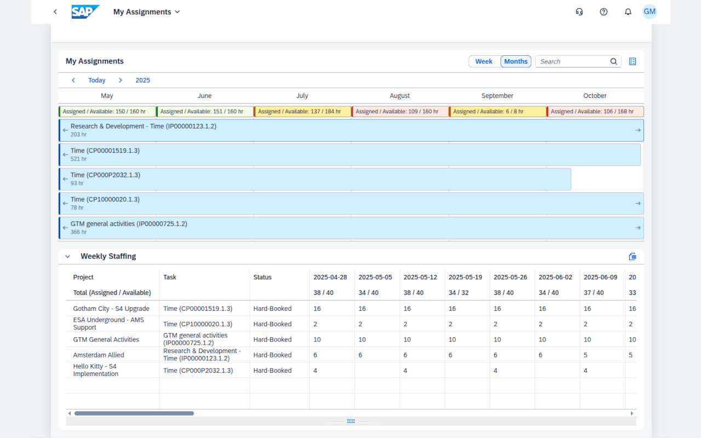

# Weekly Staffing view for SAP My Assignments

A Chrome extension for extending the visualization and export functionality in the [My Assignments application](https://fioriappslibrary.hana.ondemand.com/sap/fix/externalViewer/#/detail/Apps('F5991')/BTPR), a BTP Fiori application part of SAP Portfilio, Project and Resource Management.

This extension adds a new panel under the planning calendar with 12 months of **aggregated weekly totals** per project, with the ability to download it as an Excel file.

## Installation

Install this extension from one of the locations below:
* [Chrome Web Store](https://chromewebstore.google.com/detail/weekly-staffing-view-for/fjgcokhekdfjoblclbdpfbfhdgmkelen)
* [Microsoft Edge Add-ons](https://microsoftedge.microsoft.com/addons/detail/hbhcknfafjhmgggniaknpmbihacpeifk)

Alternatively, load this extension locally using the "Load unpacked" button in the Chrome Extensions page (Developer mode must be enabled).
